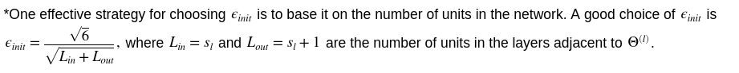
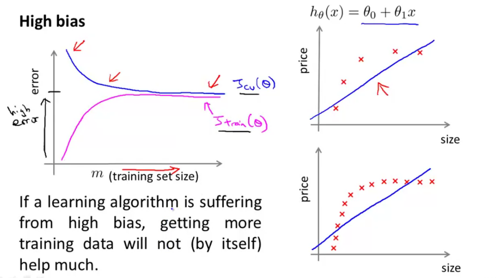
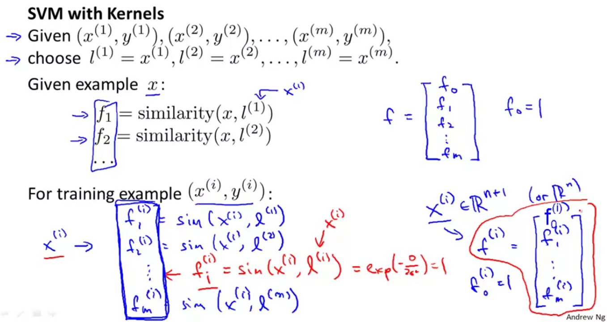
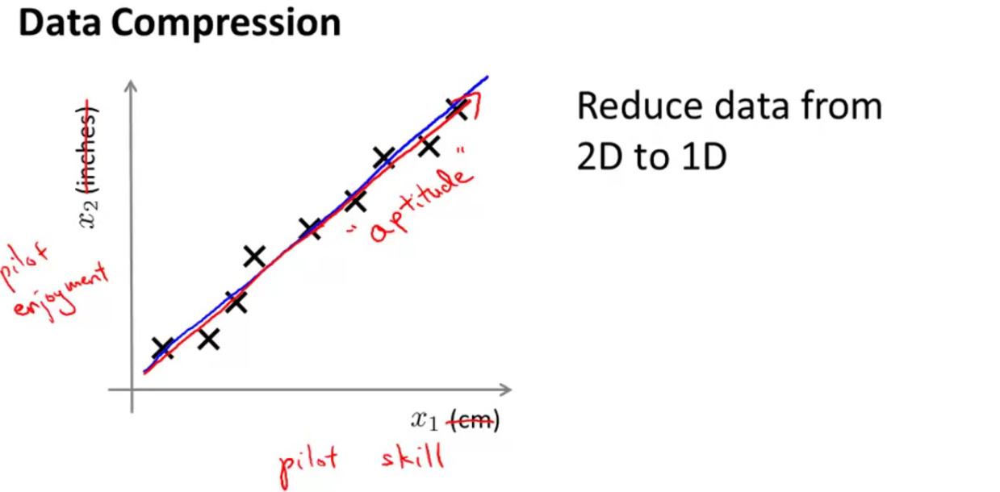
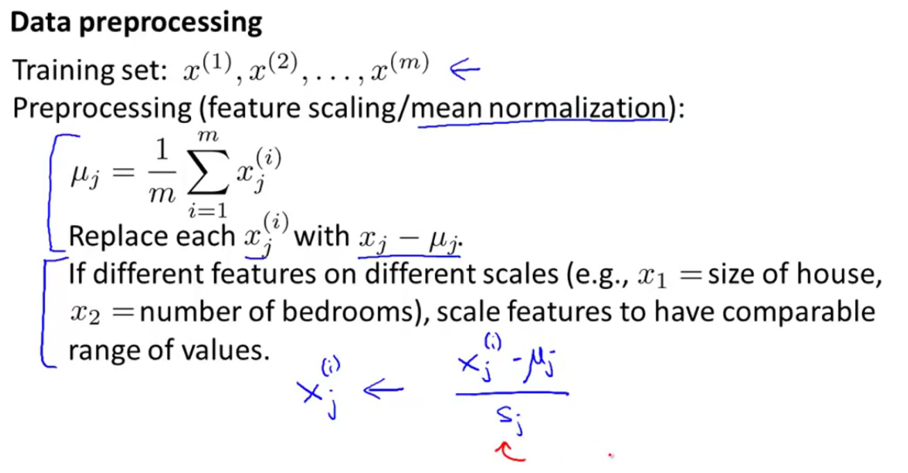
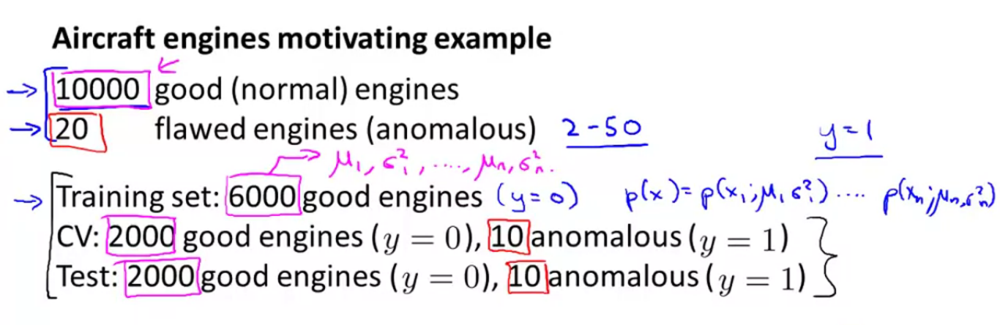
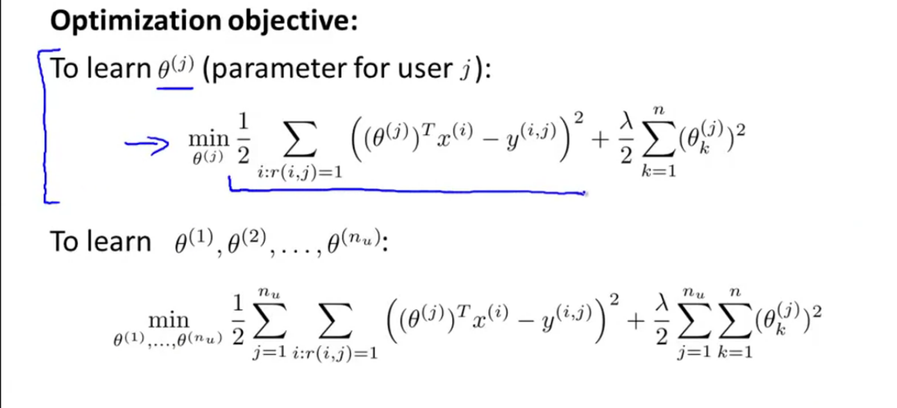
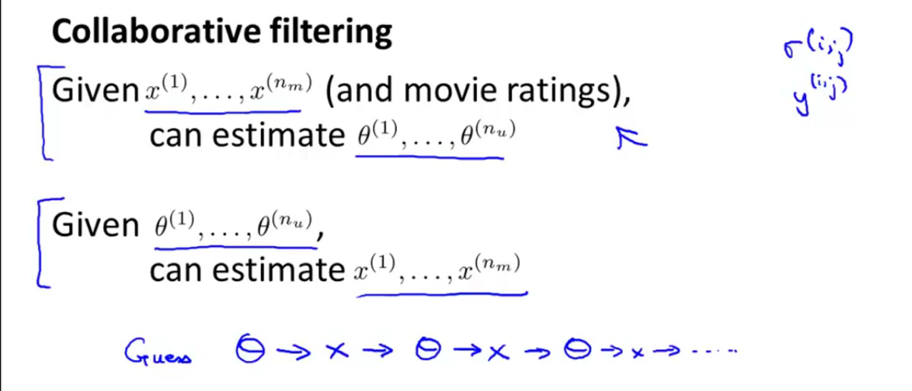
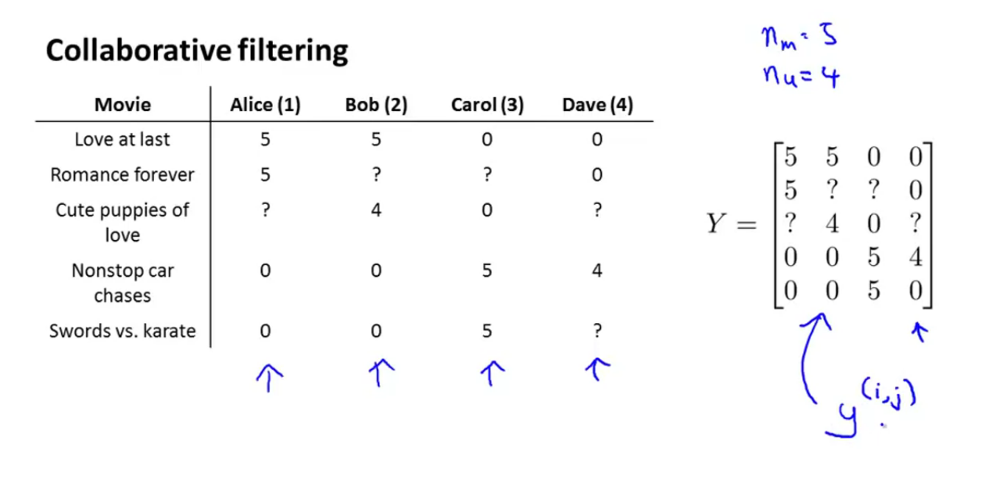

# Machine Learning

---

[TOC]

# Supervised Learning

Já se tem um banco de dados que mostra dados e os outputs esperados pelo computador.

## Modelo

| $m$         | número de exemplos de treino                      |
| ----------- | ------------------------------------------------- |
| $x$         | **variáveis de entrada (features)**               |
| $y$         | **variáveis de saída ou variáveis alvo (target)** |
| $(x,y)$     | **UM exemplo de treino**                          |
| $(x^i,y^i)$ | **i-ésimo exemplo de treino**                     |

O algoritmo gera, a partir do training set, uma hipótese $h$, função que dada uma nova entrada, gera uma resposta baseada no que aprendeu ($h:X\rightarrow Y$). No exemplo de regressão, prediz o preço de uma casa de um tamanho não listado anteriormente. 

## Regression

Estipular valores contínuos intermediários e futuros a partir de um banco de dados (Training Set). Exemplo: estimar preço de venda de casa

### Regressão linear de uma variável

$$
h_\theta(x) = \theta_0+\theta_1x
$$
$\theta_i$ são os parâmetros do modelo. Tenta-se defini-los de forma que a saída de $h_\theta$ seja a mais próxima possível dos valores do training set $(x,y)$. A definição dos parâmetros pode ser feita pelo erro quadrático médio (MSE):

$$
\min_{\theta_0,\theta_1}\frac{1}{2m}\sum_{i=1}^m(h_\theta(x^i)-y^i)^2 = \min_{\theta_0,\theta_1}J(\theta_0,\theta_1),
$$

Onde $J(\theta_0,\theta_1)$ é chamada função de custo

A média é dividida por $2$ por conveniência, de forma que a derivada no método do gradiente tenha o $2$ anulado.

### Regressão linear multivariável

| $n$     | número de features                             |
| ------- | ---------------------------------------------- |
| $x^i$   | inputs (features) do i-ésimo exemplo de treino |
| $x_j^i$ | valor da feature $j$ do i-ésimo exemplo        |

$$
h_\theta(x) = \theta_0+\theta_1x_1+\theta_2x_2+\dots+\theta_nx_n
$$

Tomando $x_0^i=1\;\forall \;i\in\{1,2,\dots,m\}$, tem-se uma notação mais simples por:
$$
x= \begin{bmatrix}x_0\\x_1\\\vdots\\x_n\end{bmatrix}\in\R^{n+1},
\quad \theta= \begin{bmatrix}\theta_0\\\theta_1\\\vdots\\\theta_n\end{bmatrix}\in\R^{n+1}
$$

$$
h_\theta(x) = \theta^T\cdot x
$$

## Método do Gradiente

Algoritmo para minimização. Para o caso da função de custo $J(\theta_0,\theta_1)$, toma-se estimativas iniciais de $\theta_0,\theta_1$ e se encontra o mínimo local iterativamente. Sem condições iniciais, toma-se ambos como $0$ :
$$
\large\theta_j:= \theta_j-\alpha\frac{\partial J(\theta_0,\theta_1)}{\partial\theta_j}
$$

$\alpha$ - escalar chamado de *Learning Rate*, tipo uma escala pro passo da iteração

Deve-se fazer a operação simultaneamente em cada $\theta_n$, de forma a não utilizar um valor atualizado para atualizar o próximo parâmetro.

### Aplicação na função de custo da regressão

$$
\large\frac{\partial J(\theta_0,\theta_1)}{\partial\theta_j} = \frac{\partial}{\partial\theta_j}\frac{1}{2m}\sum_{i=1}^m(h_\theta(x^i)-y^i)^2 = \frac{\partial}{\partial\theta_j}\frac{1}{2m}\sum_{i=1}^m(\theta_0+\theta_1x^i-y^i)^2
$$

Tem-se:
$$
\begin{cases}
\large{
\theta_0\implies\frac{\partial}{\partial\theta_0}=\frac{1}{m}\sum_{i=1}^m(h_\theta(x^i)-y^i)\\
\theta_1\implies\frac{\partial}{\partial\theta_1}=\frac{1}{m}\sum_{i=1}^m(h_\theta(x^i)-y^i)x^i_1
}
\end{cases}
$$
Portanto:
$$
\begin{align}
\theta_0&:= \theta_0-\alpha\frac{1}{m}\sum_{i=1}^m(h_\theta(x^i)-y^i)\\
\theta_1&:= \theta_1-\alpha\frac{1}{m}\sum_{i=1}^m(h_\theta(x^i)-y^i)x^i_1
\end{align}
$$

### Aplicação multivariável

$$
J(\theta_0,\theta_1,\dots,\theta_n)=J(\theta)=\frac{1}{2m}\sum_{i=1}^m(h_\theta(x^i)-y^i)^2\\
\theta_j:= \theta_j-\alpha\frac{\partial J(\theta)}{\partial\theta_j}
$$

Tratando tudo como vetores.
$$
\theta_j:=\theta_j-\alpha\frac{1}{m}\sum_{i=1}^m(h_\theta(x^i)-y^i)x^i_j
$$

### Feature Scaling

Facilitar a convergência do método, fazendo com que as features tenham limites similares. Ex: se $x_1$ vai de 0-2000 e $x_2$ de 1-5, então dividir cada valor pelo limite máximo de cada, torna a convergência melhor, $\frac{x_1^i}{2000}$ e $\frac{x_2^i}{5}$

A ideia é que se tenha $-1\le x_j\le1$ aproximadamente, pode-se ter valores próximos. De forma genérica, é aceitável $-3\le x_j\le3$ ou $-\frac13\le x_j\le\frac13$. 

### Mean Normalization

Troca o $x_j$ por $x_j-\mu_j$ para tornar a média próxima de 0 (não aplicando a $x_0$ e depois adiciona essa coluna): $x_j=\large{\frac{x_j-\mu_j}{\max x_j-\min x_j}}$, ou só max. Pode-se dividir ainda pelo desvio padrão, de forma a melhorar a aproximação. Mesmo processo anterior, porém subtraindo a média $\mu_j$ de cada feature. Torna um limite próximo de $-0.5\le x_j\le0.5$.

Para processos iterativos, é importante armazenar as médias e desvio padrões ($\mu$ e o divisor, no caso) para que previsões de valores futuros tenha a mesma normalização que as demais *features*.

### Debugging

Testar se o método do gradiente está funcionando corretamente: plotar o $\min J(\theta) \times$ iterações e ver se forma um decrescimento exponencial

### Escolha de  $\large{\mathbb{\alpha}}$

Testar uma escala de valores possíveis para o *Learning rate* $\alpha$, $0.001, 0.003, 0.01,\dots,1,\dots$ e escolher o maior que converge $J$ ou o menor anterior a este.

## Polynomial regression

Pode-se definir novas *features* com base nas existentes. Ex: se tem largura e comprimento, pode-se definir uma *feature* área para a estimação de parâmetros para venda de casa. Assim, é possível obter modelos melhores ao se definir novas *fts* e aplicar uma regressão correspondente:
$$
h(\theta) = \theta_0+\theta_1x+\theta_2x^2+\theta_3x^3\\
h(\theta) = \theta_0+\theta_1x+\theta_2\sqrt{x}
$$
Ao se analisar o gráfico do banco de dados, percebe-se que essas regressões polinomiais são similares ao gráfico de dados.

## Normal Equation

Outro método de minimizar a função de custo. Método direto, não necessitando várias iterações e definição do parâmetro $\alpha$

Para minimizar uma função $J(\theta_0, \theta_1,\dots,\theta_n)$:
$$
\theta = (X^TX)^{-1}X^Ty
$$
$X$ - *design matrix*, formada pelos vetores de feature como colunas, ou exemplos de treino como linhas (com adição de $x_0$).

Se $X$ não é invertível, pode-se utilizar a pseudo-inversa.

Com o método de função normal, torna-se desnecessário fazer *feature scaling*.

|     Método do gradiente     |        Equação normal         |
| :-------------------------: | :---------------------------: |
|  Precisa escolher $\alpha$  | Não precisa escolher $\alpha$ |
| Precisa de várias iterações |      Não precisa iterar       |
|   Bom quando $n$ é grande   |    é ruim para $n$ grande     |
|          $O(kn^2)$          | $(X^TX)^{-1} \implies O(n^3)$ |

$n = 10000$ já pode começar a pensar em gradiente. 

## Classification

Estipular um resultado discreto (sim ou não), intermediário ou futuro, a partir de um banco de dados (estimar se cancer é benigno ou não; email: spam ou nao).

Usar regressão linear não é bom:

> A classificação de forma binária faz com que um exemplo de treino possa afetar muito a predição, tornando-a ruim.

### Logistic Regression

Pretende-se ter uma hipótese de forma que $0\le h_\theta(x)\le1$. Então $h_\theta(x)=g(\theta^Tx)$
$$
\begin{align}
g(z) &= \frac{1}{1+e^{-z}}
\\\implies h_\theta(x) &= \frac{1}{1+e^{-\theta^Tx}}
\end{align}
$$
$g(z)$ - Sigmoid function (logistic function)

$h_\theta(x)$ passa a estimar a probabilidade de um novo input ser $1$, dado $x$ parametrizado por $\theta$:

$h_\theta(x)=P(y=1\;|\;x\,;\,\theta) = 1-P(y=0\;|\;x\,;\,\theta)$ 

### Decision Boundary

Se $y=1$ se $h_\theta(x)\ge0.5$ e $y=0$ se $h_\theta(x)<0.5$ . Então $y=1$ se $g(\theta^Tx)\ge0.5\implies\theta^Tx\ge0$. 

Supondo $\theta=(-3 \,\ 1 \,\ 1)$, então $y=1 $ se $x_1+x_2\ge3$, e $y=0$ caso contrário. Isso forma uma reta chamada Decision Boundary em $x_1+x_2=3$, onde $h_\theta(x)=0.5$:

> A Decision Boundary é definida pelo parâmetro $\theta$ e não pelo *training set*, pelo menos não diretamente. É definida pela hipótese.

### Non Linear Decision Boundaries

Pode-se utilizar uma função polinomial para aproximar melhor, de forma que

### Cost Function

Primeiro, define-se uma função para substituir o erro quadrático médio, que não funciona para *Logistic Regression*, já que a função não seria convexa:
$$
Cost(h_\theta(x),y)=\begin{cases}
-\ln(h_\theta(x)),&\text{se}\quad y=1\\ -\ln(1-h_\theta(x)),&\text{se}\quad y=0
\end{cases}
$$
Define-se então a função de custo, agora convexa, para *Logistic Regression*:
$$
J(\theta)=\frac1m\sum_{i=1}^m Cost(h_\theta(x^i),y^i)
$$

Ainda, para o caso binário $y \in \{0,1\}$, pode-se escrever $J(\theta)$ da seguinte forma:
$$
J(\theta)=-\frac1m\sum_{i=1}^m y^i\ln(h_\theta(x^i))+(1-y^i)\ln(1-h_\theta(x^i))
$$
Tomando o mesmo procedimento com o método gradiente, tomando derivada etc. encontra-se a mesma expressão para a minimização do $J(\theta)$ por meio de $\theta$:
$$
\theta_j:=\theta_j-\alpha\frac{1}{m}\sum_{i=1}^m(h_\theta(x^i)-y^i)x^i_j
$$
Vantagens de métodos de otimização quasi-newton e o gradiente conjugado: não precisa escolher $\alpha$ mabualmente e converge mais rápido.

### Multiclass Classification

Ex: automaticamente separar email em Trabalho, Hobby, Amigos. Diagnóstico médico, previsão do tempo, etc

O problema deixa de ser binário. Utiliza-se o método **One vs All **(ou *One vs rest*):

Pra cada classificação, existirá um problema de classificação binário. Então se as classificações são A, B e C. Tomar-se-á uma classificação binária de ser A ou não, ser B ou não ...

Então, ter-se-á $n$ hipóteses para as $n$ classificações do problema, de forma a computar a probabilidade de $y=n$. Assim, para encontrar a classe $z$ de um novo *input* $x$, toma-se o $n$ que maximiza a hipótese:
$$
z=\max_i h^i_\theta(x)
$$

## Regularization

O problema do *Overfitting*: toma-se tantas *features* que a regressão acaba virando interpolação, impedindo que valores futuros sejam previstos, porém obtendo uma estimativa excelente de valores intermediários. Obviamente que a função de custo terá valor nulo para o *training set*  e "previsão" de valores dentro do *training set* será perfeita, porém não o será para outros *inputs*

Para corrigir/evitar : 

1. Reduzir número de *features*
   - Manualmente selecionar *features* que realmente são necessárias. 
   - Usar *Model Selection Algorithm*
2. Regularization
   - Manter todas as *features*, mas diminuir a magnitude/valor dos parâmetros $\theta_j$
   - Funciona bem quando se tem muitas *features*, quando cada uma contribui um pouco para prever $y$

A ideia de regularização é ter valores pequenos para $\theta_i$, tornando a hipótese mais simples e diminuindo a chance de *overfitting*. Para forçar isso, no caso de regressão linear, basta fazer uma penalização de todos os $\theta$, com exceção de $\theta_0$ :
$$
J(\theta)=\frac{1}{2m}\left(\sum_{i=1}^m(h_\theta(x^i)-y^i)^2 +\lambda\sum_{j=1}^n\theta_j^2\right)
$$
$\lambda$ - *regularization parameter* : controla um trade-off entre aproximar bem os *training sets* (primeiro somatorio) e manter os parâmetros pequenos (feito pelo segundo somatório).

A escolha do parâmetro de regularização deve ser cuidadosa, já que um valor muito grande pode ocasionar em *underfitting*

### Na regressão linear

Para o método gradiente, toma-se a modificação:
$$
\begin{cases}
\theta_0&:= \theta_0-\alpha\frac{1}{m}\sum_{i=1}^m(h_\theta(x^i)-y^i)\\
\theta_j&:= \theta_j-\alpha\Big(\frac{1}{m}\sum_{i=1}^m(h_\theta(x^i)-y^i)x^i_j+\frac\lambda m \theta_j\Big)
\end{cases}
$$
Pode-se escrever de forma reduzida
$$
\theta_j:=\theta_j\left(1-\alpha\frac{\lambda}{m}\right)-\alpha\frac{1}{m}\sum_{i=1}^m(h_\theta(x^i)-y^i)x^i_j
$$
Usualmente $(1-\alpha\frac{\lambda}{m})$ é menor que 1. Assim essa primeira parcela diminui $\theta_j$ (pra 0.99 do valor por exemplo), aproximando-o de 0 a cada iteração. Diminui-se então o parametro a cada iteração, e é feita sobre essa atualização a regulariação.

### Normal Equation

$$
\theta = (X^TX+\lambda A)^{-1}X^Ty\\
A = \begin{vmatrix}0&0&\dots&0\\
0&1&\dots&0\\
\vdots&\vdots&\ddots&0\\
0&0&\dots&1
\end{vmatrix}
$$
Com $X$ sendo $m\times (n+1)$, $y: m\times1$ e $A:(n+1)\times(n+1)$, tipo uma matriz identidade com primeiro elemento nulo. A regularização ainda faz com que sempre tenha uma inversa, para o termo entre parenteses, tendo outra vantagem para sua implementação.

### Na regressão logística

A função de custo é modificada para:
$$
J(\theta)=-\left(\frac1m\sum_{i=1}^m y^i\ln(h_\theta(x^i))+(1-y^i)\ln(1-h_\theta(x^i))\right)+\frac\lambda {2m}\sum_{j=1}^n\theta_j^2
$$
E o update de $\theta$ se torna "igual" ao da regressão linear:
$$
\begin{cases}
\theta_0&:= \theta_0-\alpha\frac{1}{m}\sum_{i=1}^m(h_\theta(x^i)-y^i)\\
\theta_j&:= \theta_j-\alpha\Big(\frac{1}{m}\sum_{i=1}^m(h_\theta(x^i)-y^i)x^i_j+\frac\lambda m \theta_j\Big)
\end{cases}
$$

# Neural Networks

Há uma mudança de nomenclaturas para redes neurais:

## Forward Propagation

> $a_i^j\ - $ *activation* da unidade $i$ na *layer* $j$
>
> $\Theta^j\ -$ matriz de pesos que controlam a função de mapeamento da *layer* $j$ para a *layer* $j+1$

Representado pela rede neural, tem-se:
$$
a_1^2 = g(\Theta^1_{10}x_0+\Theta^1_{11}x_1+\Theta^1_{12}x_2+\Theta^1_{13}x_3)\\
a_2^2 = g(\Theta^1_{20}x_0+\Theta^1_{21}x_1+\Theta^1_{22}x_2+\Theta^1_{23}x_3)\\
a_3^2 = g(\Theta^1_{30}x_0+\Theta^1_{31}x_1+\Theta^1_{32}x_2+\Theta^1_{33}x_3)\\
h_\Theta(x)=a_1^3=g(\Theta_{10}^2a_0^2+\Theta_{11}^2a_1^2+\Theta_{12}^2a_2^2+\Theta_{13}^2a_3^2)
$$
Se uma rede tem $s_j$ unidades na *layer* $j$ e $s_{j+1}$ unidades na *layer* $j+1$, então a matriz $\Theta^j$ terá dimensão $(s_{j+1}\times s_j+1)$ $\implies\Theta^j\in\mathbb{M}_{s_{j+1}\times s_j+1}(\mathbb{K})$. O $+1$ é devido aos *bias*, fazendo algo como: o output nao inclui os nodos *bias*, mas os inputs sim.

### Forma Vetorizada

$$
z^j =\Theta^{j-1}a^{j-1}, \quad x=a^1\\
a^j=g(z^j)
$$

Para computar a hipótese, concatena-se o $a_0=1$ e, tomando $N$ como a última *layer*:

$$
z^N=\Theta^{N-1}a^{N-1}\\
h_\Theta(x)=a^N=g(z^N)
$$

> $\Theta^{j-1}:(s_{j}\times n+1),\quad a^{j-1} : (n+1)\times1,\quad z^j: s^j\times1$

### Multiclass

A hipótese $h_\Theta(x)$ será um vetor binário, com dimensão $n\times1$, onde $n$ é o número de classificações do problema. O vetor $y^i$ do *training set* será da mesma forma.

## Cost Function

> $K$ - número de unidades de saída
>
> $L$ - número total de *layers*
>
> $s_l$ - número de unidades(sem contar as *bias units*) na *layer* $l$

$$
h_\Theta(x)\in\R^K, \quad (h_\Theta(x))_i = i^{th}\text{ output}
$$

$$
J(\Theta)=-\frac{1}{m}\left[\sum_{i=1}^m\sum_{k=1}^Ky_k^i\ln(h_\Theta(x^i))_k+(1-y_k^i)\ln(1-(h_\Theta(x^i))_k)\right]+\frac{\lambda}{2m}\sum_{l=1}^{L-1}\sum_{i=1}^{s_l}\sum_{j=1}^{s_{l+1}}(\Theta_{ji}^l)^2
$$

## Backpropagation

Intuição: pra cada nodo, computar-se-á um "erro" $\delta_j^l$ do nodo $j$ na *layer* $l$
$$
\delta_j^K = a_j^K-y_j=(h_\Theta(x))_j-y_j\\
\delta^{K-1} = (\Theta^{K-1})^T\delta^K.* g'(z^{K-1})\\
g'(z^n)=a^n.*(1-a^n)
$$
Sem $\delta^1$, já que não se pretende corrigir o *input*. Assim, as derivadas parciais, sem *regularization* se tornam:
$$
\frac{\partial}{\partial\Theta_{ij}^l}J(\Theta) = a_j^l\delta_i^{l+1}
$$
De forma vetorizada para algoritmo
$$
\Delta^l=\Delta^l+\delta^{l+1}(a^{l})^T\\
\frac{\partial}{\partial\Theta_{ij}^l}J(\Theta)=D_{ij}^l:=\begin{cases}
\frac 1m\Delta_{ij}^l+\lambda\Theta_{ij}^l,&j\neq0\\
\frac 1m\Delta_{ij}^l,&j=0
\end{cases}
$$

### Gradient Checking

Para testar se o *backpropagation* realmente está funcionando, convém testar se o gradiente é próximo das aproximações das derivadas, dadas por:
$$
\frac{\partial J(\theta)}{\partial\theta_1}\approx\frac{J(\theta+\varepsilon)-J(\theta-\varepsilon)}{2\varepsilon}
$$
Para um epsilon suficientemente pequeno ($\varepsilon=10^{-4}$)

### Inicialização de $\Theta$

Inicializar tudo como $0$ não é viável para redes neurais, já quetorna todos os $a$ e $\delta$ iguais, portanto se inicializa os parâmetros de forma aleatória entre valores pertencentes a $[-\epsilon,\ \epsilon]$. Processo tomado como *random initialization* ou *symmetry breaking*

## Melhorando o algoritmo

Existem diversas opções para melhora do algoritmo, porém somente alguns realmente ajudam dependendo do problema. Dentre as opções

- Pegar mais exemplos de treino
- Tentar um conjunto menor de *features*
- Tentar tomar *features* adicionais
- Tentar tomar *features* polinomiais
- Diminuir $\lambda$
- Aumentar $\lambda$

Precisa-se ter certo conhecimento a priori de qual realmente será útil, para que não se gaste tempo desnecessário adquirindo dados não úteis ou implementando algo que não irá ajudar. Assim, existem técnicas para facilitar esse processo e nortear a escolha das mudanças a serem empregadas.

### Testando a hipótese

Para ter se estimar se a hipótese está boa, pra maioria dos casos, será difícil plotar o gráfico da hipótese e analisar seu comportamento de forma gráfica, assim é comum que se divida o *training set* em partes, $70/30$ por exemplo. E esses $70\%$ são usados para treinar a rede e os 30 restantes são usados para testar a qualidade do algoritmo. Se o banco de dados é ordenado, é melhor tomar esses $70\%$ aleatoriamente. Após, computa-se o erro dado pelo algoritmo nesse banco de dados teste, $30\%$ do BD. Para o caso de regressão linear, pode-se tomar o erro quadrático médio:
$$
J_{test}(\theta)=\frac{1}{2m_{test}}\sum_{i=1}^{m_{test}}(h_\theta(x^i_{test})-y^i_{test})^2
$$
Para regressão logística:
$$
J_{test}(\theta)=-\frac{1}{m_{test}}\sum_{i=1}^{m_{test}}y_{test}^i\ln\left(h_\theta(x^i_{test})\right)+(1-y^i_{test})\ln(1-h_{\theta}\left(x^i_{test})\right)
$$
​	ou um erro de classificação errada:
$$
err\big(h_\theta(x),y\big) = \begin{cases}
1;& h_\theta(x)\ge0.5,\ y=0\\
& ou\  h_\theta(x)<0.5,\ y=1\\
0; & c.c.
\end{cases}
$$

$$
Test\ error = \frac{1}{m_{test}}\sum_{i=1}^{m_{test}}err\big(h_\theta(x^i_{test}),y^i_{test}\big)
$$

 ### Model Selection

Determinando o grau do polinômio a ser aproximado:

Para avaliar a qualidade do grau de polinomio, divide-se o *training set* em 3 parcelas: $60\%$ de treino, $20\%$ de *validation set* ou *cross validation* e $20\%$ de conjunto de teste. A determinação do grau de polinômio a ser utilizado será dada pelo menor erro obtido ($J_{cv}$) ao se estimar o *validation set* com base nos parâmetros $\theta$ obtidos por cada modelo. E assim, pode-se determinar o erro generalizado para a aproximação por meio do erro obtido no test case ($J_{test}$).

### Underfitting vs Overfitting

Tomando-se os erros do *validation set* e *training set* pode-se estimar qual dos dois problemas é presente.

### Escolhendo o parâmetro $\lambda$ de regulaziração

Para os erros de *training set, validation set e test set*, será ignorado a regularização, de forma a se definir a situação de overfitting ou underfitting. Então, determina-se os parâmetros $\theta$ ao se minimizar $J$ e escolhe-se $\lambda$ pelo menor $J_{cv}$ obtido. Calcula-se então $J_{test}$ para se estimar o erro generalizado do algoritmo.

Ao plotar-se os erros em função de $\lambda$, encontra-se um comportamento da seguinte forma, no qual os estados de underfitting e overfitting estão trocados com relação ao anterior:

### Learning Curves

Um método interessante para se avaliar se há overfitting, underfitting ou um pouco de ambos, é plotar *learning curves*:

Esse processo é tomado com base em tomar valores arbitrários de *training set* de forma a se comparar os erros para cada dado adicional.

No caso de *high-bias* (underfitting), o erro $J_{cv}$ converge para um valor que não melhora muito com a adição de mais exemplos.

Para o caso de overfitting, nota-se uma distância grande entre $J_{cv}$ e $J_{train}$. Para esse caso, a obtenção de novos dados pode ser útil.

 

Assim, os métodos citados inicialmente, podem ser traduzidos para poder melhorar os seguintes casos:

- Pegar mais exemplos de treino -> melhorar o caso de *high variance*
- Tentar um conjunto menor de *features* -> melhorar o caso de *high variance*
- Tentar tomar *features* adicionais -> melhorar o caso de *high bias* (nem sempre)
- Tentar tomar *features* polinomiais -> melhorar o caso de *high bias*
- Diminuir $\lambda$ -> melhorar o caso de *high bias*
- Aumentar $\lambda$ -> melhorar o caso de *high variance*

### Arquitetura da rede

Como no geral, quanto maior a rede, melhor, usa-se regularização para evitar o overfitting. Para se determinar o número de hidden layers, pode-se utilizar o teste de $J_{cv}$ para se estimar o melhor número de *hidden layers* pelo menor erro. Utilizar uma só *hidden layer* é um bom default.

### Skewed Classes

Quando o DB tem mais resultados de uma classe do que de outra, claramente o erro medido é enviesado. Portanto, deve-se mudar a métrica para o erro

Se o algoritmo tem *precision* e *recall* altos, tem-se uma certeza de que o algoritmo funciona bem, mesmo com as classes enviesadas.

Para determinar então o *threshold*, pode-se tomar o valor que maximiza o F score no *cross validation set*

# Support Vector Machine

Hipótese:
$$
\min_\theta C\sum_{i=1}^m\left(y^icost_1(\theta^Tx^i)+(1-y^i)cost_0(\theta^Tx^i)\right) + \frac12\sum_{j=1}^n\theta_j^2
$$
Resulta em $1\ se\ \theta^Tx\ge0,\quad0\ c.c.$

## Kernels

Para definir as *features* de uma forma melhor

Inicialmente, toma-se os *landmarks* ($\ell_i$) como os próprios exemplos de treino $x_i$ 

Ao utilizar o kernel gaussiano, é importante utilizar feature scaling antes de aplicar o kernel.

# Unsupervised Learning

Não se tem o output pros dados de entrada. Existe um grande banco de dados, mas não se sabe classificar ou separá-los. Tem-se uma mínima ideia, ou nenhuma, de como deveria ser o output dos dados. Não se sabe o efeito das variáveis.

## Clustering

Separa os dados em *clusters* (categorias). Exemplo: pegar um banco de dados de DNA e estimar que a concentração de algum gene relaciona com a idade, localização, etc.

### K-Means

Primeiro, inicializa $K$ pontos aleatórios, pra ter $K$ clusters, chamados *cluster centroids*. Com isso, o algoritmo vai tomar o data set e determinar a classificação dos pontos com base nas centroides. Após, muda a centroide para a média dos pontos que foram classificados. Repete o processo até a convergência.

Se o cluster fica com $0$ pontos associados, elimina-se o cluster (tendo então $K-1$ clusters) ou se toma valores alaetórios para ele. A eliminação é mais usual e isso não ocorre tão frequentemente.

#### Optimization Objective

#### Random Initialization

$K<m$, m - número de training examples. Pega, randomicamente, $K$ exemplos de treino. Torna $\mu_1,\dots,\mu_k$ igual a esses $K$ exemplos.

K-means pode convergir pra um mínimo local e sua convergência é dependente da inicialização aleatória. Para diminuir a probabilidade disso acontecer $\rightarrow$ inicializar várias vezes os clusters aleatoriamente. Melhor pra quando se tem poucos clusters

#### Escolhendo o número de clusters

### Dimensionality Reduction

### Principal Component Analysis (PCA)

#### Data preprocessing

#### Algorithm

#### Reconstruction

Para retomar os valores originais de $x$ a partir dos valores $z$, toma-se a seguinte aproximação:
$$
x_{approx} = U_{reduce}z
$$

#### Escolhendo $k$

$k$ - número de *principal components* 

## Non-Clustering

Exemplo: cocktail party - separar vozes a partir de gravações diferentes do mesmos sons

### Anomaly Detection

Assumindo que se tenha vetores $y$ para os labels, pode-se avaliar a presença de features por:

### Recommender System

#### Collaborative Filtering

Não se tem uma avaliação para as características dos filmes. Tudo baseado nos usuários, que informam oquanto gostam do gênero X.

Com esse último algoritmo, tem-se $x \in \R^n, \theta\in \R^n$, ou seja, não existe o termo unitário $x_0$. 

#### Low Rank Matrix Factorization

# Large Scale Machine Learning

## Stochastic Gradient Descent

Não converge bonitinho, mas fica rodando em volta do mínimo

Não é tão utilizado, pois precisa-se gastar tempo para determinar os $const$

## Mini-Batch Gradient Descent

Melhor que o estocástico se vetorizar

## Online Learning

## Map Reduce and Data Parallelism

